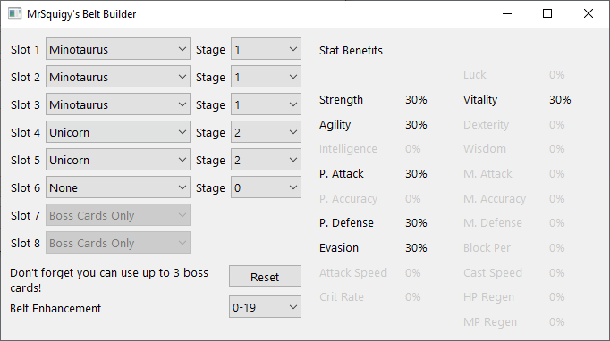

# Rappelz Belt Builder

This is a simple tool to test different belt setups in the game [Rappelz](http://en.rappelz.webzen.com).

## Overview

During Rappelz's history it has changed how belts work[[1](http://forum.webzen.com/forum/en/rappelz-english/rappelz-bug-hunting/2379523-wrong-belt-pet-bonus-on-yushiva-belts)] (without much documentation) and this has caused confusion. I made an old version of a belt builder, but I didn't know about version control and the source has gone missing, so I decided to make this new belt builder with the new belt mechanic with source available for updates.

## Contributing
At this time contributions are not accepted.